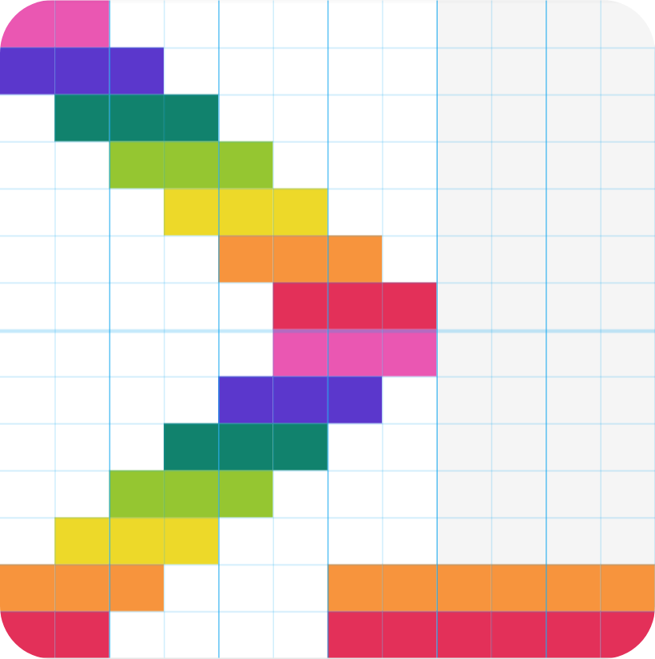

<h1 align="center"><code>colorshelll (Colorsh)</code></h1>
<!-- ALL-CONTRIBUTORS-BADGE:START - Do not remove or modify this section -->

<!-- ALL-CONTRIBUTORS-BADGE:END -->

  

  
   
  
   
  
  
   
    
  
  
   
  
  
  
  
  <h2>Links</h2>
  
  
  
  
  
   
  
  
  

 
<h2 id="tableofcontents">Table Of Contents</h1>
<ul>
<li><a href="#colorshelll-colorsh">colorshelll (Colorsh)</a>
<ul>
<li><a href="#table-of-contents">Table of Contents</a>
<li><a href="#links">Links</a></li>

<li><a href="#install">Install</a></li>
<ul>
<li><a href="#terminal">Terminal</a>
<ul>
<li><a href="#npmhttpswwwnpmjscompackageturbocolorcolorshelll"><a href="https://www.npmjs.com/package/@turbocolor/colorshelll">npm</a></a></li>
<li><a href="#yarnhttpsyarnpmturbocolorcolorshelll"><a href="https://yarn.pm/@turbocolor/colorshelll">yarn</a></a></li>
<li><a href="#pnpm">pnpm</a></li>
<li><a href="#cnpmhttpsnpmmirrorcompackageturbocolorcolorshelll"><a href="https://npmmirror.com/package/@turbocolor/colorshelll">cnpm</a></a></li>
</ul>
</ul>
</li>
<li><a href="#source-code">Source Code</a></li>
<ul>
<li><a href="#git">Git</a></li>
<li><a href="#github-cli">Github CLI</a></li> 
</ul>
<li><a href="#usage">Usage</a></li>
</ul>
</li>
</ul>
 
<h2>Install</h2>
<h3>Terminal</h3>
<h4><a href="https://www.npmjs.com/package/@turbocolor/colorshelll">npm</a></h4>
<pre>
$ npm i --save-dev @turbocolor/colorshelll
</pre>
<h4><a href="https://yarn.pm/@turbocolor/colorshelll">yarn</a></h4>
<pre>
$ yarn add --dev @turbocolor/colorshelll
</pre>
<h4>pnpm</h4>
<pre>
$ pnpm i --dev @turbocolor/colorshelll
</pre>
<h4><a href="https://npmmirror.com/package/@turbocolor/colorshelll">cnpm</a></h4>
<pre>
$ cnpm install @turbocolor/colorshelll
</pre>
<h3>Source Code</h3>
<h4>Git</h4>
<pre>
git clone https://github.com/turbocolor/colorshelll.git
</pre>
<h4>Github CLI</h4>
<pre>
gh repo clone turbocolor/colorshelll
</pre>
<h2>Usage</h2>
<pre>
npm run colorsh
</pre>
or
<pre>
npm run start
</pre>
or
<pre>
npm run colorshelll
</pre>

## Contributors ✨

Thanks goes to these wonderful people ([emoji key](https://allcontributors.org/docs/en/emoji-key)):

<!-- ALL-CONTRIBUTORS-LIST:START - Do not remove or modify this section -->
<!-- prettier-ignore-start -->
<!-- markdownlint-disable -->
<table>
  <tr>
    <td align="center"><a href="https://dwhirlpool.github.io/"> <b>Daniel Lu</b></a> <a href="https://github.com/turbocolor/colorshelll/commits?author=DWhirlpool" title="Code">💻</a></td>
    <td align="center"><a href="https://allcontributors.org"> <b>All Contributors</b></a> <a href="#content-all-contributors" title="Content">🖋</a> <a href="https://github.com/turbocolor/colorshelll/commits?author=all-contributors" title="Documentation">📖</a></td>
  </tr>
</table>

<!-- markdownlint-restore -->
<!-- prettier-ignore-end -->

<!-- ALL-CONTRIBUTORS-LIST:END -->

This project follows the [all-contributors](https://github.com/all-contributors/all-contributors) specification. Contributions of any kind welcome!